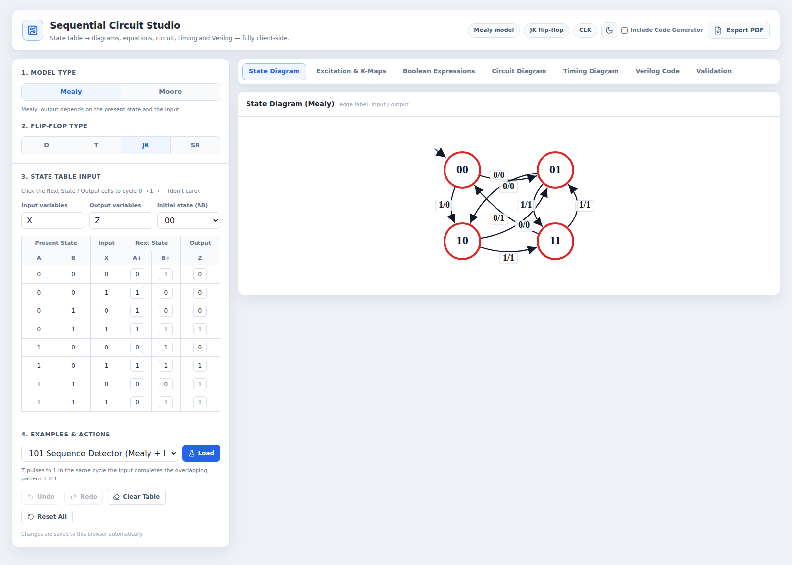
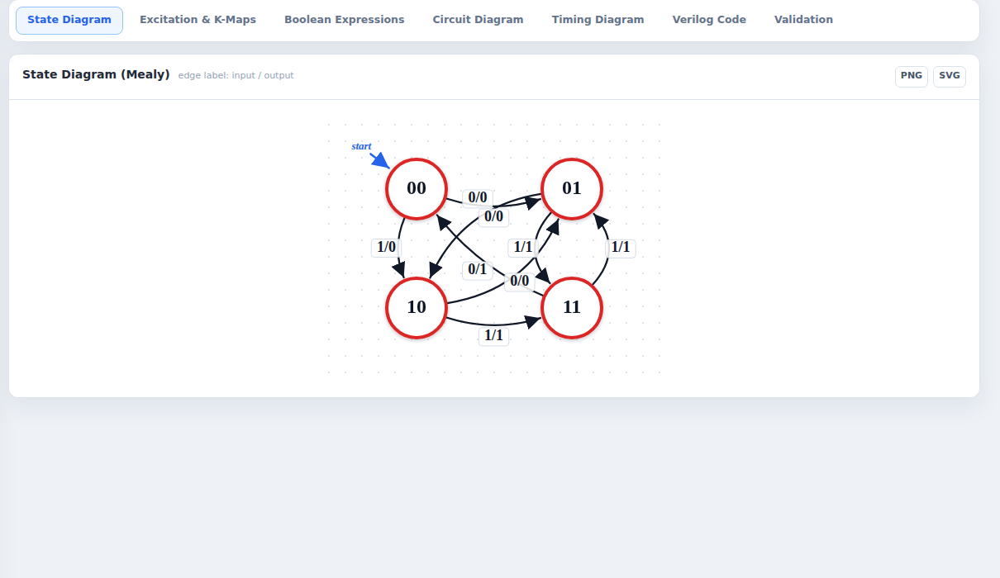
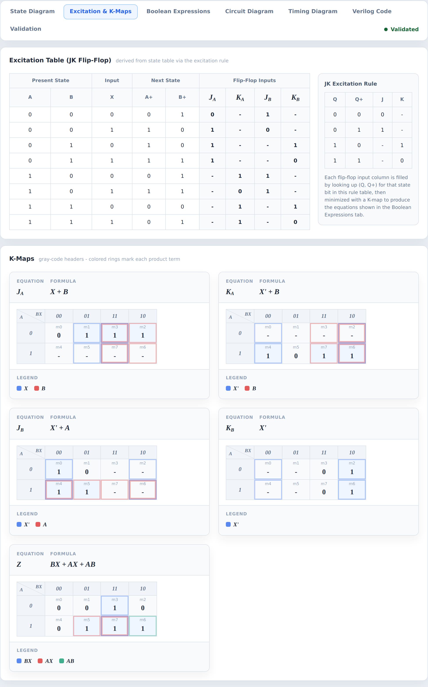
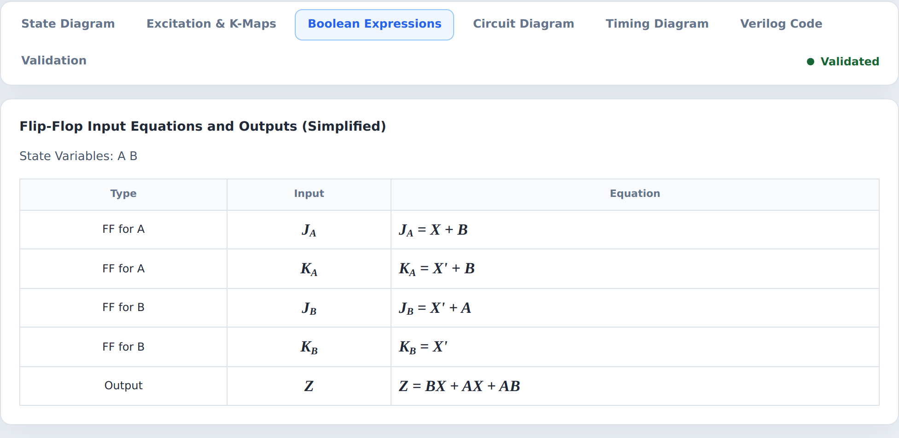
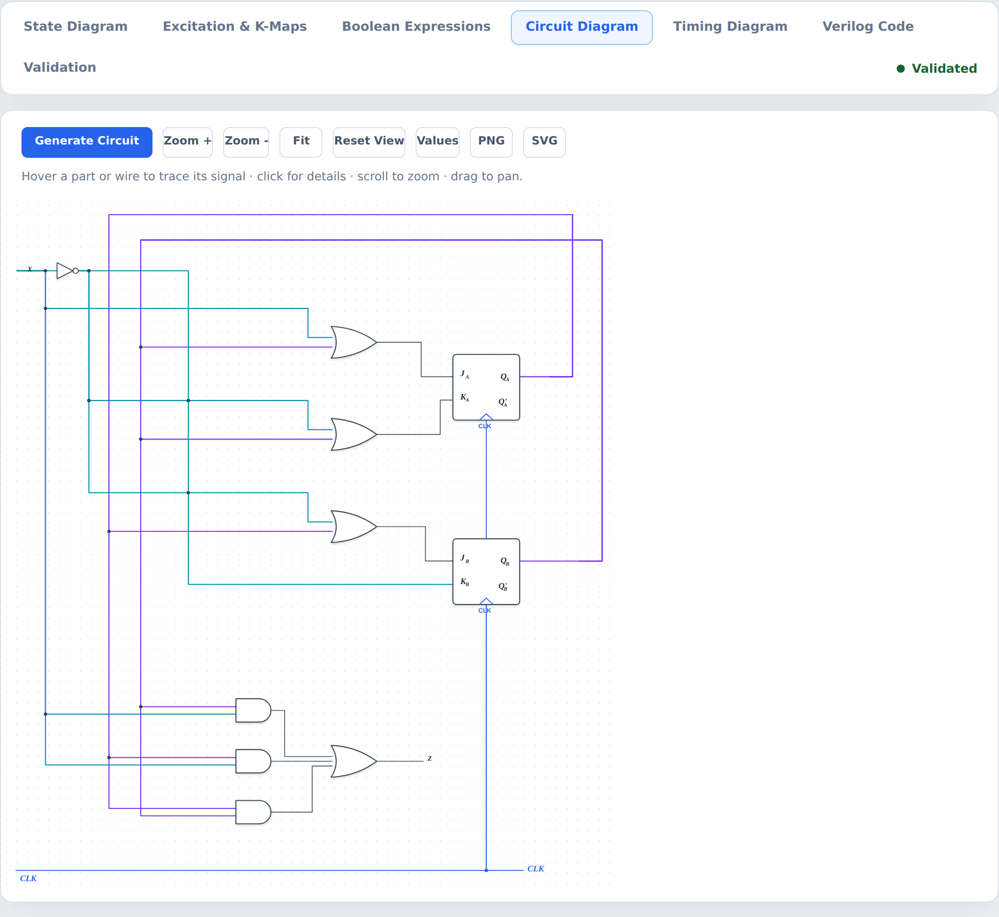
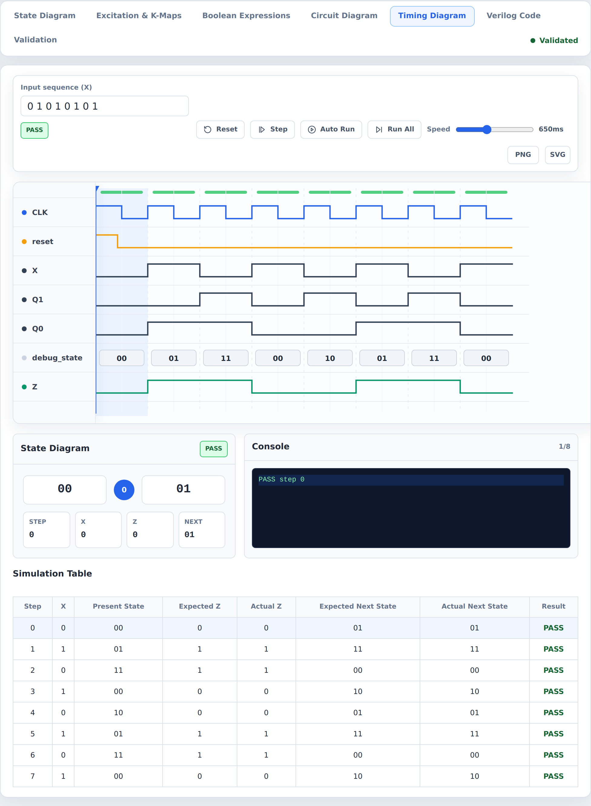
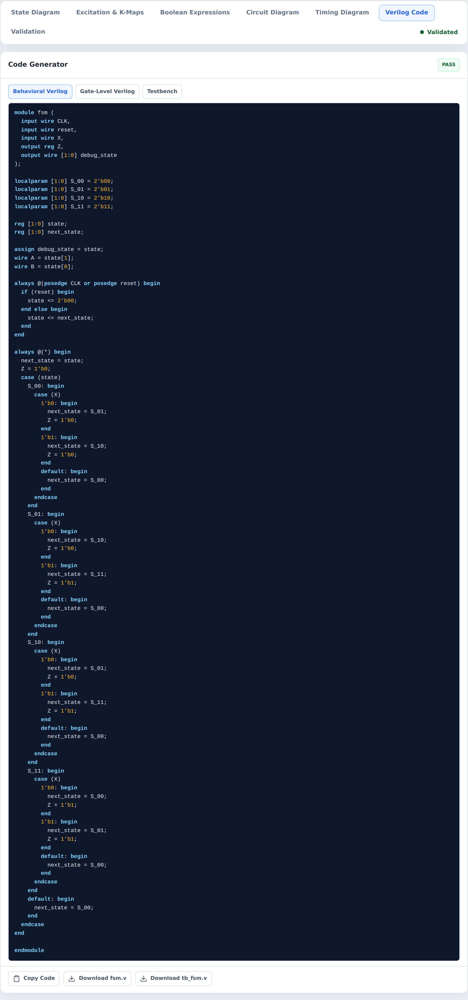
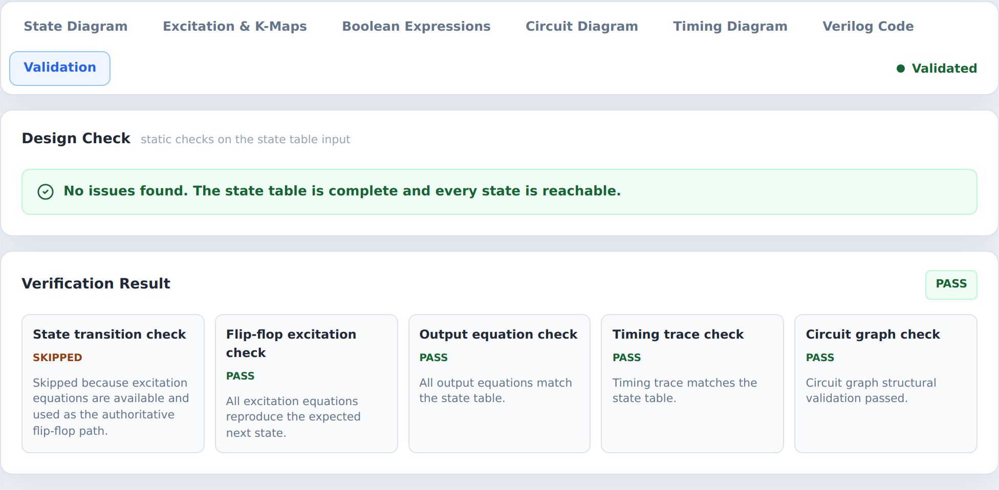
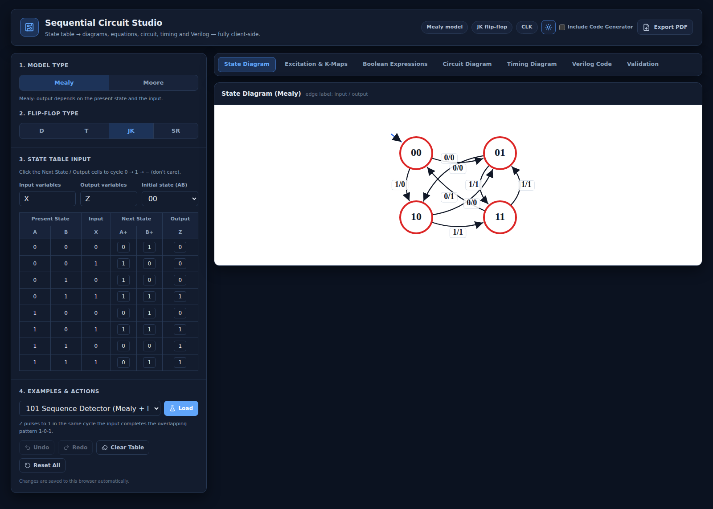

# Sequential Circuit Studio 專案報告書

> 一個在瀏覽器中執行的循序電路（Sequential Circuit）設計 EDA 工作台 —— 從一張狀態表，自動推導出狀態圖、激勵表、卡諾圖、最簡布林方程式、閘級電路圖、時序模擬，以及可合成的 Verilog，並在每一步都進行交叉驗證。

| 項目 | 內容 |
|---|---|
| **專案名稱** | Sequential Circuit Studio（循序電路設計工作台） |
| **專案類型** | 數位邏輯 / EDA（Electronic Design Automation）網頁應用 |
| **核心技術** | React 18 · TypeScript · Vite · Zustand · Konva · Cloudflare Pages Functions |
| **程式碼規模** | 約 10,700 行 TypeScript（不含測試），15 個測試檔、上百個單元測試案例 |
| **授權** | MIT |
| **撰寫日期** | 2026-06-14 |

---

## 目錄

1. [專案簡介與動機](#1-專案簡介與動機)
2. [系統需求與技術選型](#2-系統需求與技術選型)
3. [完整製作流程](#3-完整製作流程)
4. [系統功能介紹](#4-系統功能介紹含圖)
5. [專案架構](#5-專案架構)
6. [測試與品質保證](#6-測試與品質保證)
7. [部署方式](#7-部署方式)
8. [結論與未來展望](#8-結論與未來展望)

---

## 1. 專案簡介與動機

### 1.1 動機

在數位邏輯課程中，「循序電路設計」是核心而繁瑣的主題。傳統流程需要學生手動完成一連串步驟：

> 狀態表 → 狀態圖 → 狀態指定 → 激勵表 → 卡諾圖化簡 → 布林方程式 → 邏輯閘電路 → 時序分析 → HDL 實作

整個流程環環相扣，任何一步的小錯誤都會傳遞到後續步驟，而且學生很難即時驗證自己的推導是否正確。本專案的目標，便是把這條完整的設計流程「**自動化、視覺化、並且即時交叉驗證**」，讓使用者只要編輯一張狀態表，其餘所有產物都會即時重算並彼此保持一致。

### 1.2 專案定位

Sequential Circuit Studio 是一個**純前端 + 無伺服器（serverless）運算**的 EDA 工作台：

- **不需註冊帳號、不需付費 API、不需後端資料庫**。
- 前端為 React 應用程式，繁重的設計流程引擎則以 Cloudflare Pages Functions 形式在邊緣節點執行；開發時若無後端，前端會自動以瀏覽器端的本地運算遞補（local fallback）。
- 整份設計可透過 **JSON 檔案匯出 / 匯入**，也能編碼進 **URL 分享連結**，無需伺服器即可分享。



*圖 1：工作台總覽。左側為唯一資料來源「狀態表編輯器」，右側以分頁呈現各個設計流程階段的產物。*

---

## 2. 系統需求與技術選型

### 2.1 功能需求

| 編號 | 需求 | 說明 |
|---|---|---|
| F-1 | 狀態表編輯 | 支援 Mealy / Moore 模型、D/T/JK/SR 正反器、初始狀態指定 |
| F-2 | 狀態圖 | 自動排版的有限狀態機（FSM）圖，含轉態標籤與起始箭頭 |
| F-3 | 激勵表 | 依正反器激勵規則自動推導 |
| F-4 | 卡諾圖化簡 | 灰碼表頭、各乘積項群組標示（Quine–McCluskey 化簡） |
| F-5 | 布林方程式 | 最簡的次態 / 激勵 / 輸出方程式 |
| F-6 | 電路圖 | 分區佈局、網路感知（net-aware）的正交繞線閘級電路，並可互動 |
| F-7 | 時序模擬 | 自重置狀態起的逐週期波形與模擬表 |
| F-8 | Verilog 產生 | 行為級、閘級模組與自我檢查測試平台 |
| F-9 | 驗證 | 設計靜態檢查（lint）＋ 方程式／電路／時序交叉比對 |

### 2.2 非功能需求

- **即時性**：任一格編輯後，全流程於背景（debounce 去抖動）重算，畫面不閃爍。
- **一致性**：所有分頁的產物必須恆等於目前狀態表所代表的設計。
- **可測試性**：核心邏輯與 UI 框架解耦，便於單元測試。
- **可重現性**：佈局與繞線為決定性（deterministic）演算法，相同輸入恆得相同輸出。

### 2.3 技術選型

| 層級 | 技術 | 選用理由 |
|---|---|---|
| 前端框架 | **React 18 + TypeScript** | 元件化、型別安全 |
| 建置工具 | **Vite** | 快速的開發伺服器與建置 |
| 狀態管理 | **Zustand** | 輕量、可實作 undo/redo 與去抖動狀態機 |
| 繪圖畫布 | **Konva / react-konva** | 高效能的電路圖互動式 Canvas 繪製 |
| 後端運算 | **Cloudflare Pages Functions** | 以 Web 標準 `Request`/`Response` 撰寫的無伺服器函式 |
| 測試 | **Vitest** | 與 Vite 整合的單元測試框架 |
| 報表 | **jsPDF · html2canvas** | 將整個工作台匯出為 PDF |

---

## 3. 完整製作流程

本章分為兩個面向：**(A) 專案的開發歷程**（這個軟體是如何被打造出來的），以及 **(B) 設計流程引擎**（使用者的一張狀態表是如何被轉換成各種產物的）。

### 3.A 專案開發歷程

專案以漸進式、可驗證的方式分階段開發，每個階段都伴隨單元測試與 CI 把關：

| 階段 | 重點工作 | 對應里程碑 |
|---|---|---|
| **階段一：核心引擎** | 建立型別系統（`types.ts`）、狀態表模型、方程式推導（`equations.ts`）、卡諾圖與 Quine–McCluskey 化簡（`kmap.ts`、`minimizer.ts`）、正反器激勵規則（`flipFlop.ts`） | 設計流程的數學核心 |
| **階段二：電路圖管線** | 將電路圖拆分為單一職責模組（constants / geometry / nets / pins / routing / layout / validation / junctions / render / model / simulate），完成**網路感知正交繞線**，確保不同訊號不共用線段 | PR #1、#2 |
| **階段三：模擬與程式產生** | 時序模擬（`timing.ts`）、互動式模擬（`interactiveSimulation.ts`）、測試平台模擬與 Verilog 產生（`codeGenerator.ts`） | — |
| **階段四：正確性修正** | 修正常數接腳繞線、修正建置（將初始狀態位元轉送至程式產生器）、修正 FSM 模擬時序使「期望」與「實際」對齊重置狀態 | PR #3、#4 |
| **階段五：使用者體驗** | 驗證徽章去抖動（避免輸入時閃爍）、互動式電路圖（hover 追蹤訊號、點擊檢視接腳、0/1/X 數值探針） | — |
| **階段六：文件與交付** | 重整 README、加入專案總覽 PDF、補齊工作台截圖與完整功能導覽 | PR #5、#6 |

> **工程原則**：核心設計流程邏輯全部放在與框架無關（framework-agnostic）的 `src/logic` 模組中，使其可被單元測試獨立驗證，也能被 Cloudflare Functions 後端重用。佈局／繞線／驗證皆為純函式（pure functions）。

### 3.B 設計流程引擎（資料流）

使用者在左側編輯狀態表後，系統於背景執行下列管線，所有分頁同步更新：

```
狀態表 ─► 方程式推導 ─► 卡諾圖 / 化簡 ─► 電路圖 ─► 佈局 + 繞線 ─► SVG / Konva 繪製
   │                                                              │
   ├──────────────► 時序模擬 ─────────────────────────────────────┤
   │                                                              │
   └──────────────► Verilog 產生 ──────► 交叉驗證 ◄───────────────┘
```

各步驟說明：

1. **狀態表輸入**：以 `現態 + 輸入 → 次態 + 輸出` 描述 FSM；支援 Mealy/Moore 與四種正反器。
2. **方程式推導**：依模型與正反器類型推導次態方程式與輸出方程式。
3. **卡諾圖與化簡**：對每條方程式建立含灰碼表頭的卡諾圖，並以 Quine–McCluskey 法找出質含項（prime implicants）完成化簡。
4. **激勵表**：套用所選正反器（D/T/JK/SR）的激勵規則，得到正反器輸入方程式。
5. **電路圖建構**：將方程式轉為邏輯閘圖（gate graph），依「輸入 → 反相器 → AND → OR → 正反器 → 輸出」分區佈局，並做正交繞線。
6. **時序模擬**：自重置狀態起，對輸入序列逐週期模擬，產生波形與逐步模擬表。
7. **Verilog 產生**：輸出行為級、閘級模組與自我檢查測試平台。
8. **交叉驗證**：方程式 / 電路 / 時序 / HDL 彼此比對，並做設計靜態檢查（不可達狀態、陷阱狀態、don't-care 覆蓋、Moore 輸出衝突）。

---

## 4. 系統功能介紹（含圖）

以下八項功能皆由「同一張狀態表」驅動；編輯左側任一格，所有分頁都會（去抖動後）於背景重算，因此各視圖永遠彼此一致。

### 4.1 狀態表編輯器與模型設定

左側邊欄是整份設計的**唯一資料來源（single source of truth）**：

- **模型類型** —— *Mealy*（輸出取決於現態**與**輸入）或 *Moore*（輸出僅取決於現態；同一狀態各列的 Moore 輸出會自動同步）。
- **正反器類型** —— *D / T / JK / SR*；激勵表、方程式、電路圖正反器與 Verilog 全都隨之調整。
- **變數與初始狀態** —— 命名輸入／輸出，並指定重置狀態 `(AB)`。
- **狀態表** —— 點擊「次態 / 輸出」格可在 `0 → 1 → −`（don't-care）間循環。
- **範例與操作** —— 載入內建設計（序列偵測器、上／下數計數器、刻意做錯供驗證器示範的表），並支援復原／重做、清除、重置。

> 內建範例：`101 序列偵測器 (Mealy+D)`、`帶進位上／下數計數器 (Mealy+JK)`、`連續 11 偵測器 (Moore+D)`、`帶致能的 2 位元計數器 (Moore+T)`、`不完整狀態表示範 (驗證)`。

### 4.2 狀態圖



*圖 2：自動排版的狀態圖。*

自動佈局的 FSM 圖：對稱的節點配置、可避免重疊的曲線邊與 `輸入 / 輸出` 標籤、在重置狀態上標示的 **start** 箭頭，以及一個「模擬」捷徑。可匯出為 PNG 或 SVG。

### 4.3 激勵表與卡諾圖



*圖 3：激勵表與卡諾圖。每條方程式都附上以彩色環標示質含項群組的卡諾圖。*

激勵表套用所選正反器的激勵規則（並內建規則參考卡）；每條方程式都會配上一張**灰碼表頭**的卡諾圖，以彩色環標出每個質含項群組（Quine–McCluskey 化簡），並附圖例。

### 4.4 布林方程式



*圖 4：自狀態表推導出的最簡方程式。*

由狀態表推導出的最簡**次態方程式、正反器輸入（激勵）方程式與輸出方程式**——也正是用來建構電路圖與閘級 Verilog 的同一組運算式。

### 4.5 電路圖



*圖 5：閘級電路圖，採分區佈局與網路感知正交繞線。*

依「輸入／反相器 → 乘積項 `AND` → 加總 `OR` → 正反器 → 輸出」由左至右分區擺放的閘級電路圖，採用**網路感知正交繞線**——保證兩個不同訊號絕不共用同一線段，並以訊號類別著色（輸入／狀態回授／邏輯／時脈），僅在真正分歧處才畫接點圓點。它具備完整互動性：

- **滑入（Hover）** 任一元件或導線，會高亮整條訊號並淡化其餘部分。
- **點擊** 元件可看到資訊卡，列出其接腳與驅動每根接腳的網路（net）。
- **數值模式（Values mode）** —— 切換每個輸入與現態位元，即時觀察 `0 / 1 / X` 數值如何在各網路間傳遞；按 **Clock ▶** 推進一個狀態，觀察時脈驅動的變化。
- **適配視窗（Fit-to-view）**、滾輪縮放、拖曳平移，以及 PNG / SVG 匯出。

### 4.6 時序圖



*圖 6：時脈驅動的波形與逐步模擬表。*

時脈驅動的波形（CLK、重置、輸入、狀態位元、輸出），外加一張逐步的**模擬表**，會自**重置狀態**起對可編輯的輸入序列執行此狀態機。每個週期都比對期望與實際的現態／輸出／次態（`next_state` 要到下一個時脈才會成為現態），並附有主控台記錄與 Step／Auto-run／Run-all 控制。可匯出 PNG / SVG。

### 4.7 Verilog 程式碼



*圖 7：可合成的行為級、閘級模組與自我檢查測試平台。*

可合成的**行為級**與**閘級**模組，再加上**自我檢查測試平台**，全都遵循所設定的重置／初始狀態。一鍵驗證會把產生的 HDL 與狀態表交叉比對，通過後才解鎖下載；任何產物都可複製或下載。

### 4.8 驗證



*圖 8：持續性的設計檢查與交叉驗證狀態指示。*

持續性的設計靜態檢查（不可達狀態、陷阱狀態、don't-care 覆蓋、Moore 輸出衝突），加上方程式／電路／時序的交叉比對，透過一個**去抖動、不閃爍**的狀態指示徽章呈現，使結果不會在輸入過程中閃動。

### 4.9 工作台與分享

- 亮 / 暗主題、復原 / 重做、自動儲存至 `localStorage`。
- **設計檔** —— 將整份設計匯出／匯入為 JSON。
- **分享連結** —— 將整份設計編碼進 URL 雜湊；傳一條連結即可，全程不經伺服器。
- 整個工作台的 **PDF 報表** 匯出。



*圖 9：暗色主題下的工作台。*

---

## 5. 專案架構

### 5.1 整體分層

本應用拆分為 **React 前端** 與 **無伺服器 API 路由**。繁重的設計流程引擎在後端執行；React 元件只消費 API 回應。

```
functions/api/            # Cloudflare Pages Functions（後端）
├── workspace-compute.ts  #   方程式 · 卡諾圖 · 電路圖 · 驗證 · lint
├── circuit-layout.ts     #   正交繞線、主幹共用、SVG 產生
├── code-generation.ts    #   行為級／閘級 Verilog ＋ 測試平台
├── testbench-simulation.ts
└── timing-simulation.ts  #   互動式時序模擬資料

src/
├── api/                  # 上述路由的型別化 fetch 客戶端（開發時本地遞補）
├── logic/                # 設計流程引擎（與框架無關、密集單元測試）
│   ├── circuit/          #   模組化電路管線：
│   │   ├── constants · geometry · nets · pins   #   尺寸、座標、網路 id、接腳/錨點模型
│   │   ├── routing · layout · validation        #   網路感知正交繞線 + 分區佈局 + 檢查
│   │   ├── junctions · render                   #   連接點 + SVG 序列化
│   │   └── model · simulate                     #   視圖模型（signal/bus）+ 0/1/X 訊號運算
│   ├── equations · minimizer · kmap             #   推導 + Quine–McCluskey 化簡
│   ├── timing · interactiveSimulation · testbenchSimulation
│   └── circuitGraph · codeGenerator             #   閘圖 + Verilog 產生
├── lib/                  # verification、designLint、workspace（設計檔 + 分享連結編碼）
├── store/useCircuitStore.ts  # zustand store：undo/redo、自動儲存、分享連結，以及一個去抖動的
│                             #   idle/editing/validating/valid/invalid 狀態機
└── components/           # React + react-konva UI（每個分頁一個面板，保持純呈現）
```

### 5.2 資料流與防閃爍機制

每次編輯都會把上一個穩定結果留在畫面上，接著（去抖動後）於背景重算整條管線；過期回應會透過請求 id 丟棄，因此結果面板與驗證徽章都不會閃動。產生的產物（電路佈局、時序軌跡）會在編輯時失效，並在 Verilog 匯出解鎖前與狀態表比對驗證。電路管線把佈局／繞線／驗證維持為純函式；其上再疊一層 SVG 視圖模型 + 訊號模擬器，驅動互動式電路圖。

### 5.3 模組職責

| 模組 | 職責 |
|---|---|
| `src/logic/circuit/` | 電路管線，拆成單一職責模組：constants、geometry、nets、pins、routing、validation、junctions、render、layout、model、simulate |
| `src/logic`（核心） | equations、minimizer、kmap、timing、interactiveSimulation、testbenchSimulation、codeGenerator、circuitGraph |
| `src/store` | `useCircuitStore`（Zustand）—— 工作區狀態、undo/redo、自動儲存、分享連結，以及去抖動狀態機 |
| `src/components` | React + react-konva 視圖，每個分頁一個，保持純呈現 |
| `src/api` + `functions/api` | 輕量客戶端 API 搭配 Cloudflare Functions 後端與瀏覽器端開發遞補，使運算可在本地或無伺服器環境執行 |
| `src/lib` | verification、設計 lint，以及 workspace 的（反）序列化／分享連結編碼 |

### 5.4 技術棧

`TypeScript` · `React 18` · `Vite` · `Zustand` · `Konva / react-konva` · `Vitest` · `Cloudflare Pages` · `Cloudflare Functions` · `jsPDF` · `html2canvas`

---

## 6. 測試與品質保證

- **單元測試**：以 Vitest 撰寫，涵蓋 15 個測試檔、上百個測試案例，橫跨邏輯推導、佈局、繞線、模擬、程式產生與 store。
- **持續整合（CI）**：GitHub Actions 工作流程 `ci.yml` 在每次 push 與 PR 上執行 `npm test` 與 `npm run build`（型別檢查前後端 + 正式建置），建置與測試未過則無法合併。
- **決定性佈局與繞線**：網路感知正交繞線保證不同網路絕不共用線段；畫布邊界驗證器確保所有元件都在頁面內。
- **穩定的 UX**：去抖動驗證與固定位置的狀態徽章，消除輸入時的閃爍。

執行指令：

```bash
npm install
npm run dev        # 僅前端 —— http://localhost:5174/（API 客戶端在開發時遞補為本地運算）
npm test           # Vitest 單元測試
npm run build      # 型別檢查前後端，再做正式建置
npm run pages:dev  # 全端：以 wrangler 同時提供 dist/ 與 /api/* Functions
```

---

## 7. 部署方式

- **部署平台**：Cloudflare Pages + Functions。
- 應用程式由專案的 `https://<project-name>.pages.dev/` 網域提供服務。
- 詳細設定請見 [`docs/cloudflare-deployment.md`](cloudflare-deployment.md)。
- 由於前端在開發時可本地遞補運算，整個系統不依賴任何付費或第三方執行期服務。

---

## 8. 結論與未來展望

### 8.1 成果

Sequential Circuit Studio 成功把傳統上需要手算的整條循序電路設計流程——狀態表、狀態圖、激勵表、卡諾圖化簡、布林方程式、閘級電路、時序分析到 Verilog——整合進一個**即時、視覺化、且自我驗證**的網頁工作台。其工程亮點包括：

- **單一資料來源**：所有產物皆由一張狀態表驅動，永遠彼此一致。
- **決定性的電路佈局與繞線**：不同訊號絕不共用線段。
- **互動式電路圖**：可追蹤訊號、檢視接腳，並以 0/1/X 探針即時傳遞數值。
- **完整的交叉驗證**：方程式／電路／時序／HDL 彼此比對，並做設計靜態檢查。
- **無伺服器、零安裝**：純前端 + Cloudflare Functions，可用 URL 直接分享整份設計。

### 8.2 未來展望

- 支援多於 2 個狀態位元（更大規模的 FSM）。
- 加入狀態化簡（state minimization）與狀態指定最佳化。
- 擴充更多 HDL 目標（如 VHDL）。
- 加入波形與電路圖的更多匯出格式與列印版面。

---

*本報告書由專案原始碼、README 與 CI 設定整理而成，所有功能圖皆取自 `docs/screenshots/` 之實際執行截圖。*
